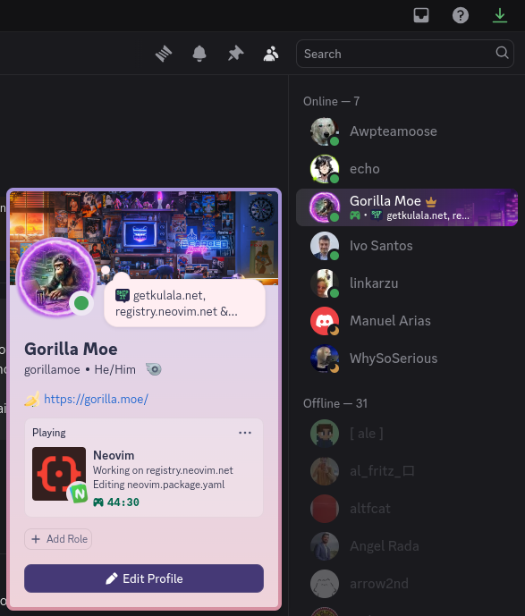

<div align="center">


# discord.nvim


[](https://github.com/mistweaverco/discord.nvim/releases/latest)

[Requirements](#requirements) • [Install](#install) • [Usage](#usage)

<p></p>

An unobtrusive Discord <a href="https://discord.com/rich-presence">Rich Presence</a> plugin that just works.

<p></p>



<p></p>

</div>

## Requirements

> [!WARNING]
> Requires [Neovim 0.10.1+](https://neovim.io)

## Features

- Light and unobtrusive
- Written in Pure Lua and is [highly configurable](#configuration)
- Custom logo if desired.
- Great looking icons!

## Installation

Use your favorite plugin manager

- [lazy.nvim](https://github.com/folke/lazy.nvim):
```lua
{ 
    'mistweaverco/discord.nvim',
    event = "VeryLazy"
}
```

- [packer.nvim](https://github.com/wbthomason/packer.nvim):
```lua
use 'mistweaverco/discord.nvim'
```

- [vim-plug](https://github.com/junegunn/vim-plug):
```vim
Plug 'mistweaverco/discord.nvim'
```

## Configuration

Configuration is not necessary for Rich Presence to work.
But for those that want to override the default configs,
the following options are available to configure Lua.

### Lua

Require the plugin and call `setup` with a config table with one or more of the following keys:

```lua
-- The setup config table shows all available config options with their default values:
require("discord").setup({
    -- General options
    auto_connect        = false,                      -- Automatically connect to Discord RPC
    logo                = "auto",                     -- "auto" or url
    logo_tooltip        = nil,                        -- nil or string
    main_image          = "language",                 -- "language" or "logo"
    client_id           = "1233867420330889286",      -- Use your own Discord application client id (not recommended)
    log_level           = nil,                        -- Log messages at or above this level (one of the following: "debug", "info", "warn", "error")
    debounce_timeout    = 10,                         -- Number of seconds to debounce events (or calls to `:lua package.loaded.presence:update(<filename>, true)`)
    blacklist           = {},                         -- A list of strings or Lua patterns that disable Rich Presence if the current file name, path, or workspace matches
    file_assets         = {},                         -- Custom file asset definitions keyed by file names and extensions (see default config at `lua/presence/file_assets.lua` for reference)
    show_time           = true,                       -- Show the timer
    global_timer        = true,                       -- if set false, timer will be reset on aucmds

    -- Rich Presence text options
    editing_text        = "Editing %s",               -- Format string rendered when an editable file is loaded in the buffer (either string or function(filename: string): string)
    file_explorer_text  = "Browsing %s",              -- Format string rendered when browsing a file explorer (either string or function(file_explorer_name: string): string)
    git_commit_text     = "Committing changes",       -- Format string rendered when committing changes in git (either string or function(filename: string): string)
    plugin_manager_text = "Managing plugins",         -- Format string rendered when managing plugins (either string or function(plugin_manager_name: string): string)
    reading_text        = "Reading %s",               -- Format string rendered when a read-only or unmodifiable file is loaded in the buffer (either string or function(filename: string): string)
    workspace_text      = "Working on %s",            -- Format string rendered when in a git repository (either string or function(project_name: string|nil, filename: string): string)
    line_number_text    = "Line %s out of %s",        -- Format string rendered when `enable_line_number` is set to true (either string or function(line_number: number, line_count: number): string)
    terminal_text       = "Using Terminal",           -- Format string rendered when in terminal mode.
})
```
## Privacy Policy

Effective Date: 2024-09-13

Your privacy is important to us.
This Privacy Policy outlines how we handle and protect your information when you use
discord.nvim (the "App").

By using the App, you agree to the terms of this Privacy Policy.

### 1. Data Collection

We do not collect, store, or process any personal or usage data from users of the App.
The App functions solely to update your Discord Rich Presence based on your current activity in Neovim.
No personal information, identifiers, or activity data are transmitted to us or any third-party service.

### 2. Data Usage

The App interacts with Discord's Rich Presence feature to
display your current Neovim activity to other users in Discord.
This interaction is handled directly between your local machine and Discord's servers.
We do not have access to any data involved in these interactions.

### 3. Third-Party Services

The App uses the official Discord API for updating Rich Presence.
Please refer to Discord’s Privacy Policy for more details on
how Discord handles your data when using their API.

### 4. Security

Although we do not collect any data,
we prioritize security in the development and maintenance of the App to
ensure that your use of it remains safe.

The App only communicates with Discord to update your Rich Presence and
does not expose your data to any other services or entities.

### 5. User Consent

By using the App,
you consent to the interaction between the App and Discord's Rich Presence API,
as described in this policy.

You understand that the App does not collect or store any personal data.

### 6. Changes to the Privacy Policy

We reserve the right to modify this Privacy Policy at any time.
Any changes will be posted on this page with an updated "Effective Date."

Your continued use of the App after changes to this Privacy Policy indicates
your acceptance of the revised terms.

### 7. Contact Us

If you have any questions or concerns about this Privacy Policy or the App,
please contact us via filing an issue on the
[GitHub repository](https://github.com/mistweaverco/discord.nvim/issues/new).

## Terms of Service

Terms of Service for discord.nvim
Effective Date: 2024-09-13

These Terms of Service ("Terms") govern your use of the discord.nvim (the "App").

By using the App, you agree to these Terms.
If you do not agree to these Terms, you may not use the App.

### 1. Acceptance of Terms

By installing, accessing, or using the App, you agree to comply with these Terms. If you do not agree to these Terms, you must not use the App. We reserve the right to modify these Terms at any time, and your continued use of the App after any such modifications indicates your acceptance of the new terms.

### 2. License

We grant you a non-exclusive, non-transferable, revocable license to use the App solely for personal, non-commercial purposes. You may not:

Modify, distribute, or copy the App.
Reverse engineer, disassemble, or attempt to access the source code of the App.
Use the App in any way that violates applicable laws or regulations.
3. App Functionality
The App is designed to display your current Neovim activity on Discord via Discord's Rich Presence feature. The App does not collect any personal data or track your usage beyond the local updates made to your Discord Rich Presence.

### 4. User Conduct

When using the App, you agree to:

Use the App solely for its intended purpose.
Not attempt to interfere with the App's functionality or access any other users' information.

### 5. Disclaimer of Warranties

The App is provided on an "as-is" and "as-available" basis,
without any warranties of any kind. We do not guarantee that the App will be error-free,
secure, or uninterrupted. You use the App at your own risk.

### 6. Limitation of Liability

To the maximum extent permitted by law,
we shall not be liable for any damages arising from the use or inability to use the App,
including but not limited to direct, indirect, incidental, or consequential damages.
This includes, without limitation, any loss of data,
interruption of service, or
issues resulting from third-party interactions (e.g., Discord API issues).

### 7. Termination

We reserve the right to terminate your access to the App at any time for any reason,
including but not limited to your violation of these Terms.
Upon termination, the rights and licenses granted to you under these Terms will immediately cease.

### 8. Third-Party Services

The App uses the Discord API to update your Rich Presence.
Your use of the App is also subject to Discord’s terms and policies,
including their Terms of Service and Privacy Policy.

### 9. Governing Law

These Terms shall be governed and construed in accordance with the laws of Germany.

Any legal actions or disputes arising in connection with these Terms
will be resolved in the courts of Germany.

### 10. Changes to These Terms

We reserve the right to modify these Terms at any time.
Any changes will be posted on this page with an updated "Effective Date."
Your continued use of the App after changes to
the Terms indicates your acceptance of the modified terms.

### 11. Contact Us

If you have any questions or concerns about these Terms,
please contact us via filing an issue on the
[GitHub repository](https://github.com/mistweaverco/discord.nvim/issues/new).

